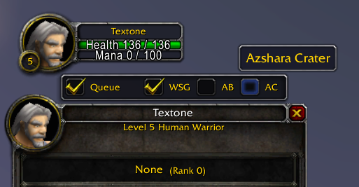

# LazyQueue-VanillaPlus

### Description:
LazyQueue addon adapted for VanillaPlus server.

Original addon: https://github.com/yutsuku/LazyQueue

### Changes:
* Changed battleground registration commands for server compatibility
* Added command to register for custom battleground Azshara Crater
* Removed Chinese language support
* Added tooltips with battleground names for checkboxes

### Installation:
1. [Download](https://github.com/for-wow/lazy-queue-vanillaplus/archive/refs/heads/main.zip) the current version of the source code
2. Open folder in the archive
3. Copy folder `LazyQueue-VanillaPlus` to addons folder: `WOW \ Interface \ AddOns \`
